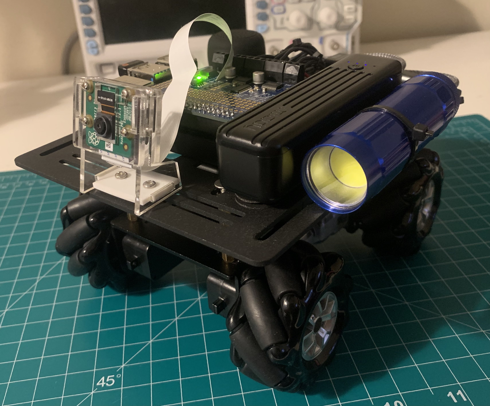
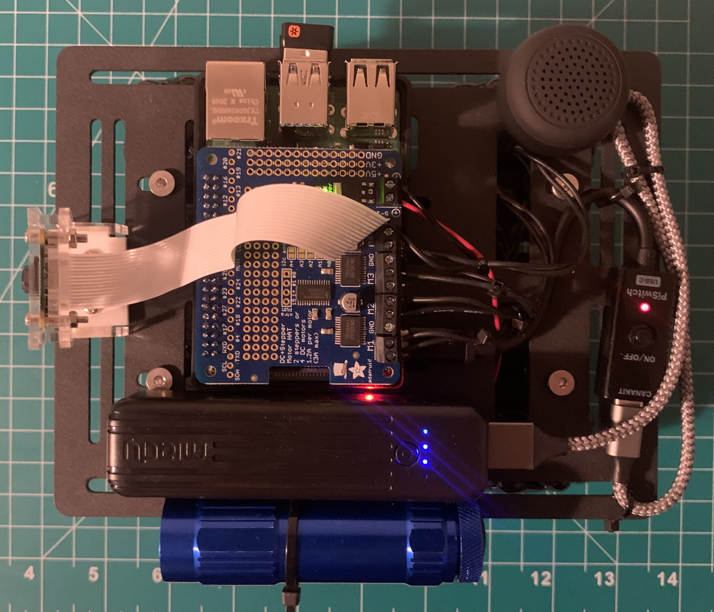

# dumpling-robot

Holonomic robot on the RPi w/ ROS Melodic. 

'dumpling' was designed to be a teleoperated robot that can be controlled with a PS4 controller. The mecanum wheel setup allows for free strafing movement along the x and y axis. A holonomic drive is implemented in order to make use of this configuration. Other drives are also implemented such as a tank drive where each analog stick directly controls the throttle of the left and right wheels. A car drive has also been implemented which was configured to mimic standard car controls with the right trigger for gas, left trigger for reverse, right analog stick for steering and right trigger for breaks. In addition, the bluetooth speaker mounted on dumpling allows for sounds to be played which can be mapped to the controller. A camera is also mounted on the robot that allows for a live camera feed that can be viewed using RViz on another machine connected to the ROS network.  dumpling can serve as a good foundation for additional features such as implementing ROS' navigation stack with a Lidar or basic object avoidance with sonars.

| dumpling | dumpling Top View |
|:--------:|:-----------------:|
|||

### Parts List

- Mecanum chassis
- 4x TT motors
- Raspberry Pi 4
- Adafruit motor hat
- Raspberry Pi camera
- Raspberry Pi camera mount
- AA battery pack (6V - 12V)
- Power bank (minimum 5V/2A)
- Bluetooth dongle
- Bluetooth speaker
- PS4 controller
- Various harnessing

### Diagram

	

### Packages

- **joy** - Connects to /dev/js0 and publishes joy topic. PS4 controller configuration was used for the following packages.
- **joy2motor** - Subscribes to joy topic and controls the motors through the Adafruit motor hat library. Includes holonomic drive, tank drive and car drive.
- **joy2sound** - Subscribes to joy topic and plays .wav and .mp3 files stored in the sounds directory.
- **raspicam_node** - Publishes image topic and streams Raspberry Pi cam feed.

### Resources

- [raspicam_node](https://github.com/UbiquityRobotics/raspicam_node)
- [joy](http://wiki.ros.org/joy)
- [How to Use Mecanum Wheels in 200 Seconds](https://www.youtube.com/watch?v=gnSW2QpkGXQ)
