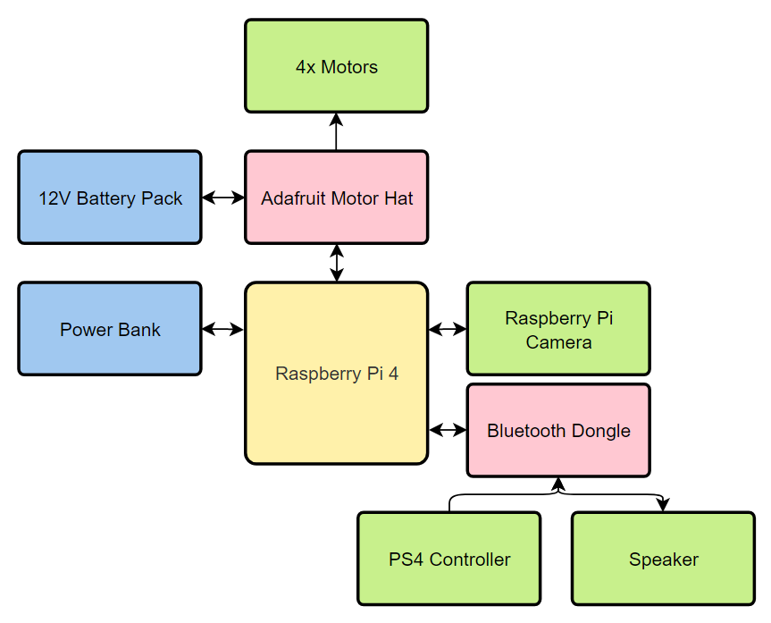

```

# dumpling-robot

Holonomic robot on the RPi w/ ROS Melodic. 


| dumpling | dumpling Top View |
|:--------:|:-----------------:|
|||

### Parts List

- Mecanum chassis
- 4x TT motors
- Raspberry Pi 4
- Adafruit motor hat
- Raspberry Pi camera
- Raspberry Pi camera mount
- AA battery pack (6V - 12V)
- Power bank (minimum 5V/2A)
- Bluetooth dongle
- Bluetooth speaker
- PS4 controller
- Various harnessing

### Diagram

<p align="center">
	
</p>

### Packages

- **joy** - Connects to /dev/js0 and publishes joy topic. PS4 controller configuration was used for the following packages.
- **joy2motor** - Subscribes to joy topic and controls the motors through the Adafruit motor hat library. Includes holonomic drive, tank drive and car drive.
- **joy2sound** - Subscribes to joy topic and plays .wav and .mp3 files stored in the sounds directory.
- **raspicam_node** - Publishes image topic and streams Raspberry Pi cam feed.

### Resources

- [raspicam_node](https://github.com/UbiquityRobotics/raspicam_node)
- [joy](http://wiki.ros.org/joy)
- [How to Use Mecanum Wheels in 200 Seconds](https://www.youtube.com/watch?v=gnSW2QpkGXQ)
```
